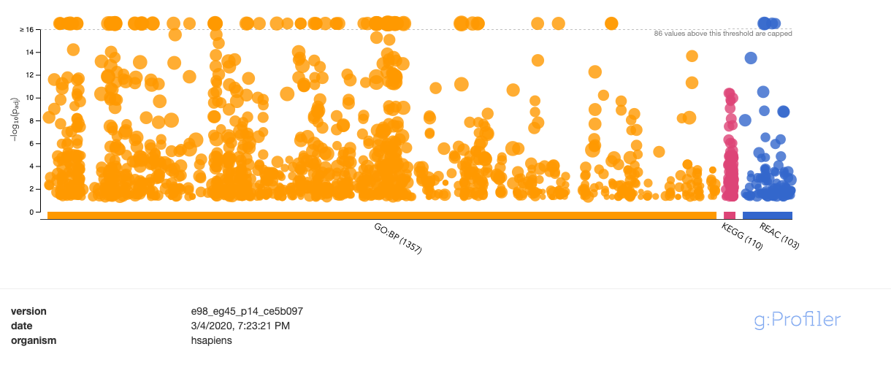
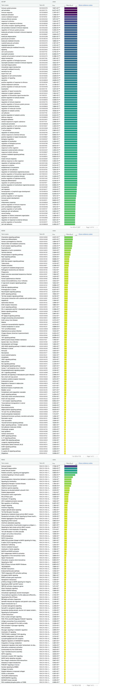
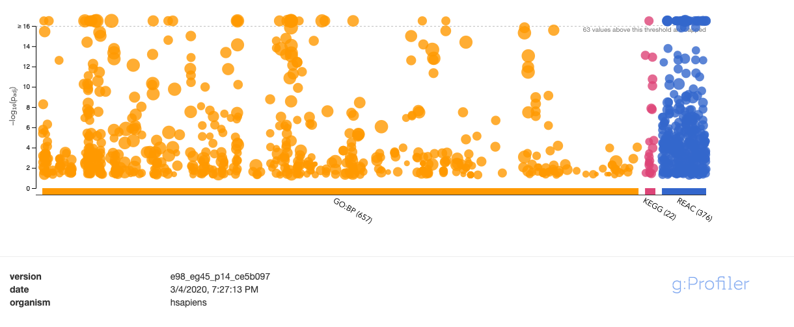
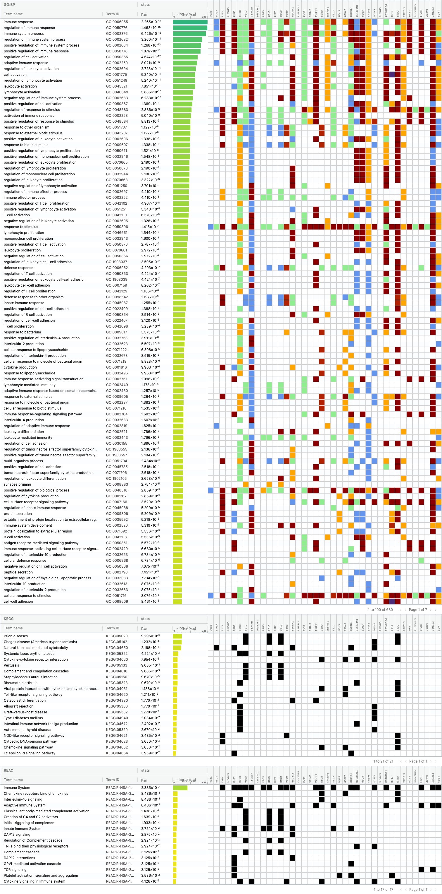
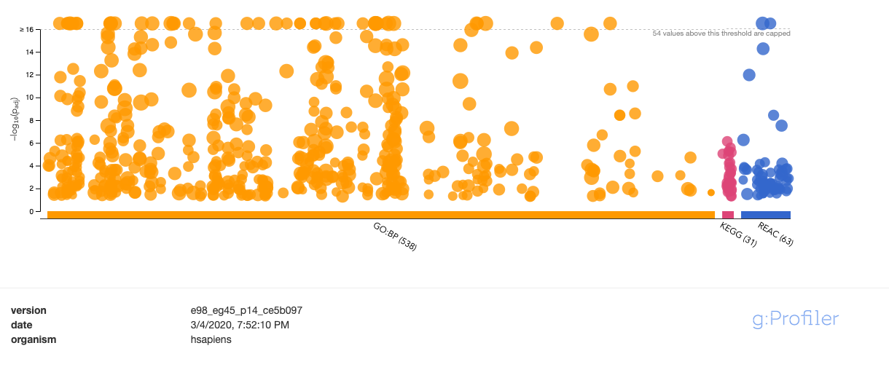
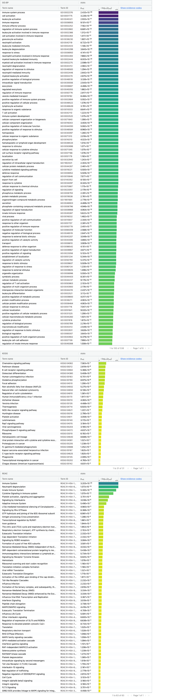

  
---
title: "Assignment 2 Sotaro Hirai R Notebook"
output:
  html_document:
    df_print: paged
    toc: yes
    toc_depth: 3
---
***
# Summary of Assignment1
***
```{r child='Assignment1.Rmd', include=FALSE, eval=TRUE, cache=TRUE}

```


```{r Prepare and Installation, message=FALSE,cache=TRUE, include=TRUE,echo=FALSE}

if (!requireNamespace("BiocManager", quietly = TRUE)) {
  install.packages("BiocManager")
}
  
if (! requireNamespace("Biobase", quietly = TRUE)) {
  BiocManager::install("Biobase")
}

if (! requireNamespace("GEOquery", quietly = TRUE)) {
  BiocManager::install("GEOquery")
}

if (!requireNamespace("limma", quietly = TRUE))
    BiocManager::install("limma")

if (!requireNamespace("edgeR", quietly = TRUE))
  BiocManager::install("edgeR")

if (!requireNamespace("ComplexHeatmap", quietly = TRUE))
    BiocManager::install("ComplexHeatmap")


if (!requireNamespace("knitr", quietly = TRUE))
    BiocManager::install("knitr")

if (!requireNamespace("gprofiler2", quietly = TRUE))
    BiocManager::install("gprofiler2")

  if (!requireNamespace('BiocManager', quietly = TRUE))
    install.packages('BiocManager')
    BiocManager::install('EnhancedVolcano')


library(BiocManager)
library(Biobase)

library(limma)
library(edgeR)

library(knitr)
library(dplyr)

library(ComplexHeatmap)
library(circlize)

library(gprofiler2)
    
library(EnhancedVolcano)

```

***
# Assignment 2 

***
### Preprocessing

##### A2 updated defined Groups

This is the short glaze of the newly defined-group table after refine the samples from 17 to 15.
```{r refine group data,echo=FALSE}

rownames(normalized_count_data) <- normalized_count_data$ensembl_gene_id
new_sample <- normalized_count_data[,c(3:10,12:15,17:19)]
# Define the groups based on selected samples:

samples <- data.frame(lapply(colnames(new_sample)[1:15],
                             FUN=function(x){unlist(strsplit(x, split = "\\_"))[c(1:3)]}))
colnames(samples) <- colnames(new_sample)[1:15]
rownames(samples) <- c("celltype","tissue","patient")
samples <- data.frame(t(samples))

normalized_count_data <- normalized_count_data[,c(1:10,12:15,17:19)]
knitr::kable(samples[c(1:5),], type="html")

```


This is a short glaze of what we start with:

The 15 samples are kept, The cell-type category is composed of CD4 and CD8, and there are 8 CD4 samples and 7 CD8 samples in the dataset. 2 samples of "bloodadult" tissue type was removed.

```{r short glaze of the table,echo=FALSE}
knitr::kable(normalized_count_data[c(1:5),c(1:5)], type="html")
```

***

##### Create data_matrix based on new samples

```{r numerical matrix, include=TRUE,echo=FALSE}

data_matrix <- normalized_count_data[,3:ncol(normalized_count_data)]
rownames(data_matrix) <- normalized_count_data$ensembl_gene_id
colnames(data_matrix) <- colnames(normalized_count_data[,3:ncol(normalized_count_data)])

```

***

### Part1. Differential Gene Expression 


#### 1. Calculate p-values for each of the genes in the expression set. 

```{r, echo=FALSE,message=FALSE}

expressionMatrix <- as.matrix(new_sample)
rownames(expressionMatrix) <- normalized_count_data$ensembl_gene_id
colnames(expressionMatrix) <- colnames(new_sample)
minimalSet <- Biobase::ExpressionSet(assayData=expressionMatrix)
```


##### Three MDS plot based on new selected samples 
```{r MDS-1-new,echo=FALSE,warning=FALSE}

par(mfrow=c(1,3))
### MDS plot represents the distances between samples
# Colored based on different tissues
limma::plotMDS(d, labels=rownames(samples),
  col = c("darkgreen","blue")[factor(samples$tissue)])
# Colored based on patients
limma::plotMDS(d, labels=rownames(samples),
  col = c("darkgreen","blue","orange","red","pink")[factor(samples$patient)])
# Colored based on cell types (CD4 or CD8)
limma::plotMDS(d, labels=rownames(samples),
  col = c("darkgreen","blue")[factor(samples$celltype)])
```


***

#### 2. Multiple Hypothesis Testing: Benjamini-Hochberg correction

In order to correct the p-values, I decided to go with the BH correction method, this method is used in class. I tried two model design in this assignment the first one is the simple model regarding the cell types. In the paper, the expriment focus on the CD4 and CD8 T cells. This would be an obvious appraoch of designing the Data Model.

***

##### Model Design #1

> The simple version linear model that only take cell type as the variable

```{r  Model-1,echo=FALSE}

model_design_1 <- model.matrix(~ samples$celltype)
knitr::kable(model_design_1, type="html")

fit1 <- limma::lmFit(minimalSet, model_design_1)
fit1.e <- limma::eBayes(fit1,trend=TRUE)
topfit1 <- limma::topTable(fit1.e, coef=2, adjust.method = "BH",
                   number = nrow(expressionMatrix))

output_hits1 <- merge(normalized_count_data[,1:2],topfit1,by.y=0,by.x=1,all.y=TRUE)  # merge hgnc names to topfit table
output_hits1 <- output_hits1[order(output_hits1$P.Value),] # sort by pvalue
```

***

> Ranked genes with Top p-value

```{r fit table_2,echo=FALSE}
knitr::kable(output_hits1[1:5,],type="html")
```

> Short summary of # of genes that pass the thresholds

Gene pass the threshold p-value < 0.05 from Model #1 (Cell type only)
: `r length(which(output_hits1$P.Value < 0.05)) `

Genes pass correction with adj.P-value < 0.05 (Cell type only)
: `r length(which(output_hits1$adj.P.Val < 0.05))`

Gene pass the threshold p-value < 0.01 from Model #1 (Cell type only)
: `r length(which(output_hits1$P.Value < 0.01)) `

Genes pass correction with adj.P-value < 0.01 (Cell type only)
: `r length(which(output_hits1$adj.P.Val < 0.01))`

***

##### Model Design #2

> The complex version model that takes cell type and tissue type as its variables.

To create a different linear model with a little bit more complexity. I used two arguments, one is the previous selected **cell type** and the other from the MDS plot I selected the **tissues**.

```{r Model-2,echo=FALSE}

model_design_2 <- model.matrix(~ samples$celltype + samples$tissue)
knitr::kable(model_design_2, type="html")

fit2 <- limma::lmFit(minimalSet, model_design_2)
fit2.e <- limma::eBayes(fit2,trend=TRUE)
topfit2 <- limma::topTable(fit2.e, coef=2, adjust.method = "BH",
                   number = nrow(expressionMatrix))

output_hits2 <- merge(normalized_count_data[,1:2],topfit2, by.y=0,by.x=1,all.y=TRUE) # merge hgnc names to topfit table
output_hits2 <- output_hits2[order(output_hits2$P.Value),] # sort by pvalue

```

> Ranked genes with Top p-value

This is the resulting table with ranked genes with Top p-value
```{r fit table_1,echo=FALSE}
knitr::kable(output_hits2[1:5,],type="html")
```


> Short summary of # of genes that pass the thresholds

Gene pass the threshold p-value < 0.05 from Model #2 (cell type + tissue)
: `r length(which(output_hits2$P.Value < 0.05))`

Genes pass correction from Model #2 (cell type + tissue)
: `r length(which(output_hits2$adj.P.Val < 0.05))`

Gene pass the threshold p-value < 0.01 from Model #1 (Cell type only)
: `r length(which(output_hits2$P.Value < 0.01))`

Genes pass correction with adj.P-value < 0.01 (Cell type only)
: `r length(which(output_hits2$adj.P.Val < 0.01))`


***
##### Compare the results from the two design models


```{r, echo=FALSE}
model1_pvalues <- data.frame(ensembl_id = output_hits1$ensembl_gene_id,
                                 pvalue1 = output_hits1$P.Value)

model2_pvalues <- data.frame(ensembl_id = output_hits2$ensembl_gene_id,
                                 pvalue2 = output_hits2$P.Value)

two_models_pvalues <- merge(model1_pvalues,model2_pvalues,by.x=1,by.y=1)


# set colors 
two_models_pvalues$colour <- "grey"
two_models_pvalues$colour[two_models_pvalues$pvalue1<0.05] <- "orange"
two_models_pvalues$colour[two_models_pvalues$pvalue2<0.05] <- "blue"
two_models_pvalues$colour[two_models_pvalues$pvalue1<0.05 & two_models_pvalues$pvalue2<0.05] <- "red"


plot(two_models_pvalues$pvalue1,two_models_pvalues$pvalue2,
     col = two_models_pvalues$colour,
     xlab = "Cell Type only model p-values",
     ylab = "Cell Type + Tissue model p-values",
     main="Cell Type + Tissue vs Cell Type only")

```
The above plot shows the P value of genes between the two models. Model #1 with only cell-type is colored in Orange, Model #2 with cell type + tissue is colored in Blue.

By reading this graph, we can conclude that the Multiple Parameter Data Model works better for my dataset, and I will keep using the second model for the future study.

***

##### Using QLF method within EdgeR package

```{r DGE-1, echo=FALSE}
# Set up our edgeR objects(based on cell_type)
d1 = edgeR::DGEList(counts=new_sample, group=samples$celltype)

# Model design - Estimate dispersion
d1 <- edgeR::estimateDisp(d1, model_design_2)

# Fit the model
fit.edgeR <- edgeR::glmQLFit(d1, model_design_2)

```


Calculate differential expression using the Quasi liklihood model with coef="cell-type"
```{r ,echo=FALSE}
qlf.CD8_vs_CD4 <- edgeR::glmQLFTest(fit.edgeR, coef='samples$celltypeCD8')

knitr::kable(edgeR::topTags(qlf.CD8_vs_CD4), type="html")

qlf_output_hits <- edgeR::topTags(qlf.CD8_vs_CD4,sort.by = "PValue",
                                  n = nrow(new_sample))

```

***

> Short summary of genes that pass the threshold

Total genes
: `r nrow(qlf_output_hits)`

Gene pass the threshold p-value < 0.05 using edgeR
: `r length(which(qlf_output_hits$table$PValue < 0.05))`

Genes pass correction with QLF model with p-value < 0.05
: `r length(which(qlf_output_hits$table$FDR < 0.05))`

Gene pass the threshold p-value < 0.01 using edgeR
: `r length(which(qlf_output_hits$table$PValue < 0.01))`

Genes pass correction with QLF model with p-value < 0.01
: `r length(which(qlf_output_hits$table$FDR < 0.01))`

Genes p-value < 0.05 and abs(logFC) >= 1
: `r length(which(qlf_output_hits$table$PValue < 0.05 & abs(qlf_output_hits$table$logFC) >= 1))`
 
 

```{r compare-2, echo=FALSE}


qlf_pvalues <- data.frame(ensembl_id = rownames(qlf_output_hits$table),
                                 qlf_p = qlf_output_hits$table$PValue)

two_models_pvalues <- merge(model1_pvalues,qlf_pvalues,by.x=1,by.y=1)


# set colors 
two_models_pvalues$colour <- "grey"
two_models_pvalues$colour[two_models_pvalues$pvalue1<0.05] <- "orange"
two_models_pvalues$colour[two_models_pvalues$qlf_p<0.05] <- "blue"
two_models_pvalues$colour[two_models_pvalues$pvalue1<0.05 & two_models_pvalues$qlf_p<0.05] <- "red"


plot(two_models_pvalues$pvalue1,two_models_pvalues$qlf_p,
     col = two_models_pvalues$colour,
     xlab = "Limma model p-values",
     ylab = "qlf model p-values",
     main="Compare p-values from two models")

```


***
##### Estimate the dispersion of my data

Using the MeanVar Plot to explore the mean-variance relationship. 
Only the trended dispersion is used under the quasilikelihood pipeline.

```{r mean-var plot, echo=FALSE, message=FALSE}
edgeR::plotMeanVar(d, show.raw.vars = TRUE,                
            show.tagwise.vars=TRUE,                 
            show.ave.raw.vars = TRUE,                                                 
            NBline=TRUE,
            show.binned.common.disp.vars = TRUE,
            main = "Binomial distribution")
```

Calculate dispersion to observe variance deviates from the mean.
Biological Coefficient of Variation (BCV) and dispersion is a measure of how much variation there in the samples.

```{r BCV-plot, echo=FALSE}
edgeR::plotBCV(d,col.tagwise = "black",col.common = "red", 
        main = "BCV plot of RNA-seq data")
```


***

#### 3. Highlight genes of interest with MA Plot or a Volcano plot

Here is a summary of the number of Up regulated and down regulated genes:

Up Regulated Genes
: `r length(which(qlf_output_hits$table$PValue < 0.05 & qlf_output_hits$table$logFC > 0))`

Down Regulated Genes
: `r length(which(qlf_output_hits$table$PValue < 0.05 & qlf_output_hits$table$logFC < 0))`


##### M A plot

Use the quasi-liklihood models to fit the data and QLF -test to test for differential expression

```{r MA plot-1, echo=FALSE}

# M vs A plot
# knitr::kable(colnames(normalized_count_data))

top_hit_result <- topfit2[rownames(minimalSet), ]

MA_status <- apply(top_hit_result, 1, function(gene) {
  if (gene["logFC"] < 0 && gene["adj.P.Val"] <= 0.05) {
    return("Down Regulate Gene")
    } 
  if (gene["logFC"] > 0 && gene["adj.P.Val"] <= 0.05) {
    return("Up Regulate Gene")
    } 
  else {
    return("Not Significant Gene")
  }
})

limma::plotMD(fit2.e, column = 2, cex = 0.4, status = MA_status ,main = "MA plot of differentially expressed gene")

limma::plotMD(fit2.e, column = 2, ylim = c(-200,200),xlim = c(0,300), cex = 0.4, status = MA_status ,main = "Zoomed-in MA plot of differentially expressed gene")

```
The MA plot shows the difference between two conditions by graphing the average intensity by log ratio


There are multiple outliners which has a significant value of the logCPM (average log expression), therefore I assign xlim and ylim to zoom in to the plot to be able to observe whether the distribution of the up and down regulated genes is as expected.


##### Volcano Plot
```{r volcano plot, echo=FALSE,message=FALSE,warning=FALSE}
KeyVals <-  rep('black', nrow(qlf_output_hits))
names(KeyVals) <- rep('not significant', nrow(qlf_output_hits))


KeyVals[which(qlf_output_hits$table$logFC > 0 & qlf_output_hits$table$FDR < 0.05)] <- 'red'
names(KeyVals)[which(qlf_output_hits$table$logFC > 0 & qlf_output_hits$table$FDR < 0.05)]<- 'up regulated'

KeyVals[which(qlf_output_hits$table$logFC <= 0 & qlf_output_hits$table$FDR < 0.05)] <- 'blue'
names(KeyVals)[which(qlf_output_hits$table$logFC <= 0 & qlf_output_hits$table$FDR < 0.05)]<- 'down regulated'


EnhancedVolcano::EnhancedVolcano(qlf_output_hits$table, 
                                 x = 'logFC',
                                 y = 'FDR',
                                 title = 'Volcano plot of differentially expressed gene',
                                 subtitle = FALSE,
                                 lab = rownames(qlf_output_hits),
                                 pCutoff = 1.3, colCustom = KeyVals,
                                 col=c('black', 'black', 'black', 'red3'),)

```

This is the volcano plot using *EnhancedVolcano* package.

***

#### 4. Visualize the top hits using a heatmap


>HeatMaps of top hit genes using Limma Model#2 (accounting for cell-type and tissue variability)

* With P.value < 0.05
* Columns ordered by cell types (CD4 or CD8)

```{r heat map-2, echo=FALSE, cache=TRUE, warning=TRUE}

top_hits <- output_hits2$ensembl_gene_id[output_hits2$P.Value < 0.01]
heatmap_matrix_tophits <- t(scale(t(data_matrix[which(rownames(data_matrix) %in% top_hits),])))


if(min(heatmap_matrix_tophits) == 0){
    heatmap_col = colorRamp2(c( 0, max(heatmap_matrix_tophits)), 
                             c( "white", "red"))
  } else {
    heatmap_col = colorRamp2(c(min(heatmap_matrix_tophits), 0, max(heatmap_matrix_tophits)), c("blue", "white", "red"))
  }
current_heatmap <- Heatmap(as.matrix(heatmap_matrix_tophits),
                           cluster_rows = TRUE,
                           cluster_columns = FALSE,
                               show_row_dend = TRUE,
                               show_column_dend = FALSE, 
                               col=heatmap_col,
                               show_column_names = TRUE, 
                               show_row_names = FALSE,
                               show_heatmap_legend = TRUE,
                               )
current_heatmap
```


* With adj.P.Val < 0.01
* Columns ordered by Tissues (Thymus or Bloodinfant)

```{r heat map-3, echo=FALSE, cache=TRUE}


top_hits <- output_hits2$ensembl_gene_id[output_hits2$adj.P.Val < 0.01]


heatmap_matrix_tophits <- t(scale(t(data_matrix[which(rownames(data_matrix) %in% top_hits),])))

heatmap_matrix_tophits <- heatmap_matrix_tophits[,c(grep(colnames(heatmap_matrix_tophits), pattern = "thymus"), 
                                                    grep(colnames(heatmap_matrix_tophits), pattern = "bloodinfant"))]


if(min(heatmap_matrix_tophits) == 0){
    heatmap_col = colorRamp2(c( 0, max(heatmap_matrix_tophits)), 
                             c( "white", "red"))
  } else {
    heatmap_col = colorRamp2(c(min(heatmap_matrix_tophits), 0, max(heatmap_matrix_tophits)), c("blue", "white", "red"))
  }
current_heatmap1 <- Heatmap(as.matrix(heatmap_matrix_tophits),
                           cluster_rows = TRUE,
                           cluster_columns = FALSE,
                               show_row_dend = TRUE,
                               show_column_dend = FALSE, 
                               col=heatmap_col,
                               show_column_names = TRUE, 
                               show_row_names = FALSE,
                               show_heatmap_legend = TRUE,
                               )
current_heatmap1
```

Generally we can observe the same cell type with same tissue type samples are definitely clustered in groups.

By reading the first heatmap we can observe that with in the Cell type groups, different tissue type shows differences in there gene expression pattern, with the second heatmap, within the same tissue, the gene of different cell type also express differently.

***

##### Up and down-regulated genes

```{r}


up_genes <- rownames(qlf_output_hits$table)[qlf_output_hits$table$logFC >= 0 
                            & qlf_output_hits$table$FDR <= 0.05]

up_genes <- normalized_count_data[up_genes, ]

down_genes <- rownames(qlf_output_hits$table)[qlf_output_hits$table$logFC <= 0 
                            & qlf_output_hits$table$FDR <= 0.05]

down_genes <- normalized_count_data[down_genes, ]


diff_genes <- rbind(up_genes, down_genes)

# write.table(rownames(up_genes), file = "up_genes.txt", quote = F, row.names = F, col.names = F)
# write.table(rownames(down_genes), file = "down_genes.txt", quote = F, row.names = F, col.names = F)
write.table(rownames(diff_genes), file = "diff_genes.txt", quote = F, row.names = F, col.names = F)


```

***

### Part2. Thresholded over-representation analysis (ORA)

**Which method did you choose and why?**

I used g:profiler for the thresholded gene set enrichment analysis.

**What annotation data did you use and why? What version of the annotation are you using?**

I chose GO:BP, KEGG and REAC as my annotation data.

GO biological process: releases/2019-07-01
KEGG: KEGG FTP Release 2019-09-30
Reactome: ensembl classes: 2019-10-2


**How many genesets were returned with what thresholds?**
The threshold is 0.05.

Upregulated genes: 
1353 go bioligical process terms, 110 KEGG terms and 103 REAC terms

Downregulated genes: 
657 go bioligical process terms,22 KEGG terms and 376 REAC terms

Diff genes:
538 go bioligical process terms, 31 KEGG terms and 63 REAC terms

**Run the analysis using the up-regulated set of genes, and the down-regulated set of genes separately. How do these results compare to using the whole list (i.e all differentially expressed genes together vs. the up-regulated and down regulated differentially expressed genes separately)?**


#####Up-Regulated Genes





#####Down-Regulated Genes






##### Up + Down Genes (all differentially expressed genes)






# References

